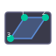

# SWSectionWorkbench

A lightweight clipping and sectioning workbench for [FreeCAD](https://www.freecad.org) that enables fast interactive cross-section visualization directly inside the 3D viewport.

The workbench uses **Coin3D `SoClipPlane`** nodes inserted into the active scene graph, providing real-time visual sectioning **without modifying original model geometry**.

---

## Installation

1. Copy the entire `SWSectionWorkbench` folder into your FreeCAD **Mod** directory:

   | OS      | Path |
   |---------|------|
   | Windows | `%APPDATA%\FreeCAD\Mod\` |
   | Linux   | `~/.local/share/FreeCAD/Mod/` |
   | macOS   | `~/Library/Application Support/FreeCAD/Mod/` |

2. Restart FreeCAD.
3. Select **SW Section** from the workbench drop-down.

---

## Commands & Toolbar

| Icon | Command | Shortcut | Description |
|------|---------|----------|-------------|
|  | **Section ON** | `Shift+S` | Activate section from selected face / plane |
|  | **Section OFF** | `Shift+D` | Remove the active clip plane |
|  | **Toggle Section** | `Shift+T` | Toggle section on/off |
|  | **Flip Normal** | `Shift+F` | Reverse the clipping direction |
|  | **Section Offset / Controls** | `Shift+O` | Open the interactive offset panel |
|  | **Section from 3 Points** | `Shift+3` | Define plane through 3 selected vertices |
|  | **Create Datum Plane** | – | Insert a reference plane at the section position |

---

## Workflow

### Basic face section
1. Click a planar face on your model.
2. Press **Section ON** (`Shift+S`).
3. Use **Flip Normal** if the wrong half is hidden.
4. Press **Section OFF** when done.

### Section from a datum plane
1. Select a PartDesign datum plane or reference plane.
2. Press **Section ON**.

### Section from 3 vertices
1. `Ctrl+Click` three vertices on your model.
2. Press **Section from 3 Points** (`Shift+3`).

### Interactive offset
1. Activate a section (any method above).
2. Press **Section Offset / Controls** (`Shift+O`).
3. Drag the slider or type a value to move the plane along its normal.
4. Click **Flip Normal** or **Remove Section** as needed.

---

## Supported Inputs

* Planar **Part faces**
* **PartDesign datum planes** (`PartDesign::Plane`)
* **Part reference planes** (`Part::Plane`)
* Any object carrying a **Placement** (uses its local Z-axis as normal)
* Three **selected vertices** (defines the plane analytically)

---

## Technical Notes

* Clipping is performed by inserting a single `SoClipPlane` node at index 0 of the active 3-D view's scene graph via **Pivy / Coin3D**.
* The engine is a module-level singleton (`SWSectionCore.ENGINE`) shared by all commands and the task panel.
* All operations are **non-destructive**: no document objects are created or modified (except the optional *Create Datum Plane* command).

---

## Compatibility

| Component | Requirement |
|-----------|-------------|
| FreeCAD   | ≥ 0.21 (tested on 1.0 / 1.1) |
| Python    | ≥ 3.9 |
| Pivy      | Bundled with FreeCAD |

---

## License

LGPL-2.1-or-later — open-source FreeCAD extension intended for experimentation, visualization, and workflow enhancement.
